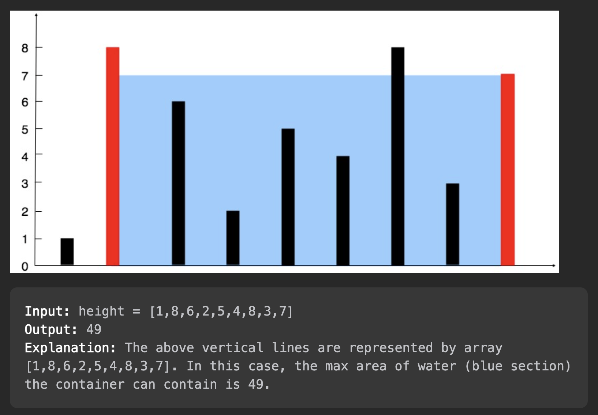

# Container with most Water

This is one of the **Leetcode's** interesting problem involving the concept of Two Pointers. The basic idea is to form a container from the given lines that can store maximum amount of water.

> Topics : Two Pointers, Array

> Problem Link: [View Problem](https://leetcode.com/problems/container-with-most-water/description/)

> Accepted Time Complexity: O(N)

# Explanation

The idea is to take two pointers and put them at the two end of the Array. Now the question comes up on how should we move the pointers?

Suppose we have our pointers at index **i** and **j**, then we can prove that if the height of line at index **i** is less than the one at index **j** then we can not get a better solution for any index **i** and **k** such that **k>i** and **k<j**. 

Suppose we have two pointers **i**, **j** with the height of lines defined as **h[i]** and **h[j]**.  It's given that **h[i] < h[j]**. Current amount of water stored by the container formed by the lines at index **i** and **j** will be:

> Amount of Water stored by **[i, j]** = Min(h[i], h[j]) * (j - i)
>                                                              = h[i] * (j - i)

Now let's try to find a better solution between pointer **i** and any pointer **k** which is less than **j**.
To find a better solution let's assume that the line at pointer **k** has a maximum height (assuming we can store maximum amount of water) (**h[k] >> h[i]**). So the amount stored by container formed by the lines at index **i** and **k** will be:

> Amount of Water stored by **[i, k]** = Min(h[i], h[k]) * (k - i)
>  = h[i] * (k - i)

Since **k < j**
It's safe to say that **(k - i) < (j - i)**

Hence it's proved that:
>  h[i] * (k - i) < h[i] * (j - i)

> Amount of Water stored by **[i,k]** < Amount of Water stored by **[i,j]**

Hence we can safely say that for two pointers **i** and **j**, we need to move the pointer with smaller height closer to the other pointer to look for a better result.

We will start with our pointers i and j at the two extreme ends of the array. We will compare the height of line segments at two pointers and move the pointer at smaller line segment closer to the other pointer.